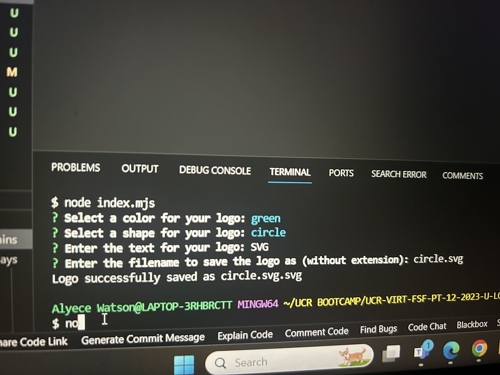

SVG LOGO MAKER

Description:The application enables users to enter inputs into an inquirer prompt in order to generate a logo "logo.svg" file which contains the user's desired results as a SVG image which then allows the user to save it in a .svg file where they can view the image.

Usage Instructions:
1. Open the cloned repository in any source code editor e.g. Visual Studio Code. 
2. Open integrated terminal on index.js 
3. Enter "node index.js" in the command line 
4. Through sequential order within the command line interface - the user will be presented with npm inquirer questions - the user will provide a response to each question and proceed. 
5. Once completed a SVG file named "logo.svg" will be created. 
6. At your discretion, you may rename the "logo.svg" file to the file name of your choice. 
7. (Optional) Regarding future use, you may alter the prompted questions within the index.mjs to best suit your needs. 

Installation Process:
1. Clone the repository
2. Install the following: • Node.JS Version 21.7.1 • Jest Version : 29.7.0 • Inquirer.js: Version 9.2.16
3. Open the cloned repository in any source code editor. 
4. Open the integrated terminal for the document and complete the respective installation guides provided above in section (2.) to ensure the cloned documentation will operate.

Screenshots:
Command line application:

Jest Testing "npm test":

Generated "logo.svg" file:

Video Link:https://drive.google.com/file/d/1XEWlCFZz0L6dVk9tDQ1dIESlTHSbOhd-/view?usp=sharing